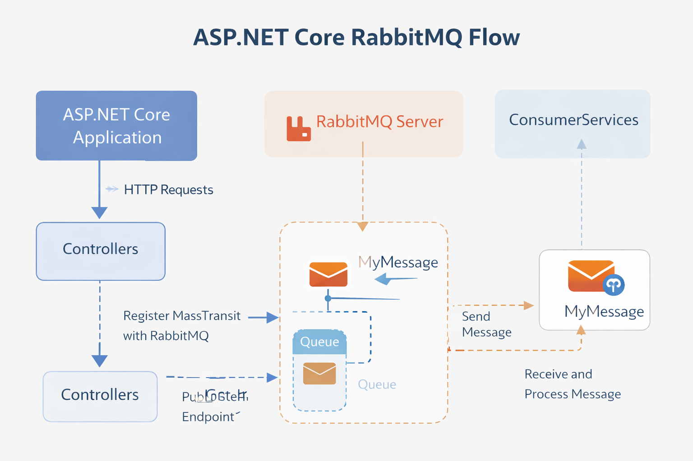

# 🐇 RabbitMQ in .NET Microservices

RabbitMQ is a lightweight, reliable message broker often used in **.NET microservices** for asynchronous communication, decoupling, and scalability.

## ✅ Benefits
- **[Loose Coupling](ca://s?q=RabbitMQ_loose_coupling_in_microservices)** → Services communicate asynchronously, reducing dependency on availability.  
- **[Reliability](ca://s?q=RabbitMQ_reliability_features)** → Durable queues, persistent messages, retries, and DLQs ensure no data loss.  
- **[Scalability](ca://s?q=RabbitMQ_scalability_in_microservices)** → Multiple consumers can process messages in parallel.  
- **[Flexibility](ca://s?q=RabbitMQ_flexibility_features)** → Supports pub-sub, work queues, RPC, and event-driven patterns.  
- **[Integration](ca://s?q=RabbitMQ_.NET_integration)** → Works seamlessly with MassTransit, ASP.NET Core, and cloud-native deployments.  

## 🔴 Limitations
- **[Operational Complexity](ca://s?q=RabbitMQ_operational_complexity)** → Requires monitoring, clustering, and tuning.  
- **[Latency](ca://s?q=RabbitMQ_latency_issue)** → Adds overhead compared to direct synchronous APIs.  
- **[Consistency](ca://s?q=RabbitMQ_consistency_limitations)** → Eventual consistency; not suitable for strict ACID workflows.  
- **[Scaling Broker](ca://s?q=RabbitMQ_scaling_broker)** → RabbitMQ can bottleneck under extreme throughput compared to Kafka.  
- **[Learning Curve](ca://s?q=RabbitMQ_learning_curve)** → Developers must understand exchanges, bindings, and routing keys.  

## 🌟 Features
- **[Exchanges](ca://s?q=RabbitMQ_exchanges)** → Direct, Fanout, Topic, Headers for routing.  
- **[Queues](ca://s?q=RabbitMQ_queues)** → Durable, exclusive, auto-delete options.  
- **[Acknowledgements](ca://s?q=RabbitMQ_acknowledgements)** → Ensures reliable delivery.  
- **[Dead-Letter Queues](ca://s?q=RabbitMQ_dead_letter_queues)** → For failed/rejected messages.  
- **[Message TTL](ca://s?q=RabbitMQ_message_TTL)** → Expiry control for time-sensitive workloads.  
- **[Management UI](ca://s?q=RabbitMQ_management_UI)** → Monitoring and debugging.  
- **[Plugins](ca://s?q=RabbitMQ_plugins)** → Shovel, Federation, delayed message exchange.  

---

# 🎤 Interview Q&A (8 Years Experience)

### Q1: Why RabbitMQ over REST APIs in microservices?
**Answer:** REST is synchronous and tightly coupled. RabbitMQ enables asynchronous, decoupled communication. If PaymentService is down, OrderService can still accept orders and queue events.  

**Cross Question:** *What if strict consistency is required?*  
**Answer:** Use transactional outbox patterns or synchronous APIs for critical paths, while RabbitMQ handles non-critical async tasks.

### Q2: How do you ensure reliability in RabbitMQ?
**Answer:** Durable queues, persistent messages, acknowledgements, retries, and DLQs. Consumers must be idempotent to avoid duplicate processing.  

**Cross Question:** *How do you handle poison messages?*  
**Answer:** Poison messages go to DLQ. We monitor DLQ, fix consumer logic, and reprocess after correction.

### Q3: How do you scale RabbitMQ consumers in .NET?
**Answer:** Deploy multiple instances of ConsumerAPI. RabbitMQ distributes messages via competing consumers. Use **prefetch count** to balance load.  

**Cross Question:** *What if one consumer is slower?*  
**Answer:** Adjust **prefetch count**, use consumer priority, and monitor throughput with RabbitMQ Management UI.

### Q4: When would you avoid RabbitMQ?
**Answer:** Avoid RabbitMQ in simple CRUD apps, low-latency synchronous workflows, or when strong consistency is mandatory. Kafka or direct APIs may be better.  

**Cross Question:** *Why Kafka instead of RabbitMQ for high throughput?*  
**Answer:** Kafka is optimized for event streaming and partitioned logs, handling millions of events per second. RabbitMQ is better for transactional, smaller-scale messaging.

# 🟢 Scenario-Based Q&A

## Scenario 1: Order → Payment → Inventory Workflow
**Answer:**  
- OrderService publishes `OrderPlaced`.  
- PaymentService consumes → publishes `PaymentConfirmed`.  
- InventoryService consumes → updates stock.  

**Cross Question:** *What if PaymentService fails after consuming?*  
**Answer:** Use acknowledgements only after success, retry policies, DLQ, and idempotent consumers.

## Scenario 2: Retry & Dead-Letter Queue Handling
**Answer:** Configure MassTransit retry policies (immediate, incremental, exponential). Poison messages go to DLQ.  

**Cross Question:** *How do you reprocess DLQ messages?*  
**Answer:** Replay DLQ after fixing consumer logic or build DLQ reprocessor service.

## Scenario 3: Scaling Consumers
**Answer:** Deploy multiple ConsumerAPI instances. RabbitMQ load-balances via competing consumers.  

**Cross Question:** *What if one consumer is slower?*  
**Answer:** Adjust prefetch count, use consumer priority, monitor throughput.

## Scenario 4: Monitoring & Observability
**Answer:** Use RabbitMQ Management UI, Prometheus + Grafana.  

**Cross Question:** *What metrics are most critical?*  
**Answer:** Queue depth, consumer throughput, unacked messages, DLQ size.

## Scenario 5: When Not to Use RabbitMQ
**Answer:** Avoid in synchronous workflows, strong consistency, or high-throughput streaming.  

**Cross Question:** *How do you decide between RabbitMQ and Kafka?*  
**Answer:** RabbitMQ → transactional workloads. Kafka → event streaming, analytics, millions of events/sec.

# 📊 Summary Table

| Scenario        | RabbitMQ Strength              | Cross Question Challenge            |
|-----------------|--------------------------------|-------------------------------------|
| **Order Flow**  | Decoupled async workflow       | Payment failure handling             |
| **Retries/DLQ** | Reliable error handling        | Poison message reprocessing          |
| **Scaling**     | Horizontal consumer scaling    | Slow consumer balancing              |
| **Monitoring**  | Management UI + Prometheus     | Critical metrics                     |
| **Avoidance**   | Clear boundaries               | Kafka vs RabbitMQ trade-off          

# 🧩 ASP.NET Core RabbitMQ Flow

This diagram illustrates how **PublisherAPI** and **ConsumerAPI** interact through **RabbitMQ** using **MassTransit** in an ASP.NET Core environment.

## ⚙️ Flow Overview

### **PublisherAPI**
- Handles HTTP requests via Controllers.
- Publishes messages using **MassTransit**.
- Sends a `MyMessage` object to RabbitMQ Exchange.
- Message is routed to the queue **my-weather-queue**.

### **RabbitMQ Server**
- Acts as a message broker.
- Stores messages until consumed.
- Ensures reliable delivery and decoupled communication.

### **ConsumerAPI**
- Registers `ConsumerServices` with MassTransit.
- Subscribes to **my-weather-queue**.
- Processes incoming messages asynchronously.

### **MassTransit**
- Simplifies RabbitMQ integration.
- Handles serialization, routing, and retries.
- Connects publisher and consumer seamlessly.

